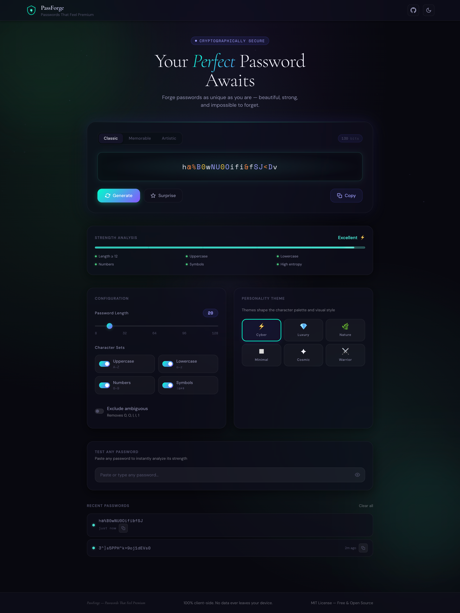

# PassForge ⚡

**Passwords That Feel Premium**

> The most beautiful, secure, and memorable password generator on the internet.

---

## ✨ Preview

---

## ✨ Features

### 🔐 Three Generation Modes
- **Classic** — Length slider (8–128), character set toggles, exclude ambiguous chars
- **Memorable** — Beautiful passphrases like `Azure-River-42!` you'll actually remember
- **Artistic** — Visually striking patterns: Symmetric, Bookend, Cascade, Wave

### 🎨 Personality Themes
Choose from 6 themes that shape the character palette and interface:  
`Cyber` · `Luxury` · `Nature` · `Minimal` · `Cosmic` · `Warrior`

### 📊 Strength Analysis
- Real-time scoring (0–100) with 5 levels: Weak → Fair → Good → Strong → Excellent
- Entropy calculation in bits
- Animated segmented progress bar with color progression

### 🧪 Test Any Password
Paste any password for instant strength analysis with entropy, length, and charset stats.

### 📜 Password History
Last 10 generated passwords shown as elegant cards — click to reload, one-click copy.

### ✨ Surprise Me
Randomly switches theme, mode, and length for delightful discovery.

---

## 🚀 Getting Started

PassForge is a static website — no build step, no dependencies.

Just open `index.html` or deploy it anywhere (GitHub Pages, Vercel, Netlify, etc.).

---

## 🛠️ Tech Stack

- HTML5 + Tailwind CSS (CDN)
- Vanilla JavaScript
- Web Crypto API
- 100% client-side

---

## 📄 License

MIT © PassForge Contributors — see [LICENSE](LICENSE) for details.

---

**Made with love ❤️ by [BlackBirdo.com](https://blackbirdo.com)**

Free forever. Beautiful by design.

